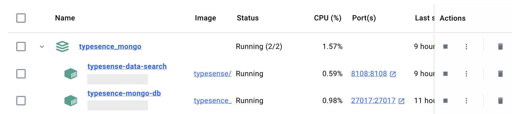

<p align="center">
   <br/>
  
</p>
<h4 align="center">
    Build Typesence module for <a href="https://github.com/nestjs/nest">NestJS</a> <br/> Synchronous data from MongoDB & Demonstrate
</h4>
<br/><br/>

## Overview

- [Typesense]() is a fast, typo-tolerant search engine for building delightful search experiences.
- An Open Source Algolia Alternative & An Easier-to-Use ElasticSearch Alternative

## Install development tools

-   Install NodeJS LTS 20.9.0: [https://nodejs.org](https://nodejs.org/en)

    -   Check node version:
        ```sh
        node -v
        ```
    -   If Node.js is existed on your computer and node version is not v20.9.0 then we need install [nvm](https://github.com/nvm-sh/nvm?tab=readme-ov-file#install--update-script)
    -   Install v20.9.0

        ```sh
        nvm install 20.9.0

        # switch to correct node version
        # note: run it again before we need start project on a new terminal
        nvm use v20.9.0
        ```

-   Install Version Control: [https://git-scm.com/](https://git-scm.com/)
-   Install Docker: [https://www.docker.com/get-started/](https://www.docker.com/get-started/)
-   Install NestJS latest: [https://nestjs.com/](https://nestjs.com/)
-   Install MongoDB Compass: [https://www.mongodb.com/](https://www.mongodb.com/products/tools/compass)

## Installation on your local

#### Clone project

```sh
git clone https://github.com/hainguyen27798/typesense-mongo.git
```

Switch to `main` branch

```sh
git switch main
```

Copy from `.env.example` to `.env.local` and configure in `.env.local`

#### Start project

1. Configure `.env.local`:
    ```dotenv
    # Mongo config
    MONGO_BD_NAME='enter your db name'
    MONGO_USERNAME='enter your db user'
    MONGO_PASSWORD='enter your db pass'
    MONGO_PORT=27017
    MONGO_HOST=mongo

    API_PORT=8080

    # typesense config
    TYPESENSE_HOST=typesense
    TYPESENSE_PORT=8108
    TYPESENSE_PROTOCOL=http
    TYPESENSE_API_KEY='create a new key from "openssl rand -hex 32"'
    ```
2. Install containers required
    ```sh
    docker compose --env-file .env.local up -d
    ```
   And turn off `api` container
    ```sh
    docker ps -a
    ```
    
3. Extract sample data
    ```sh 
   sh unzip-data.sh
    ```
4. Check node version: [Install NodeJS LTS 20.9.0](#install-development-tools)
5. Install dependencies
    ```sh
    yarn install
    ```
6. Start project
    ```sh
    yarn start:local
    ```
